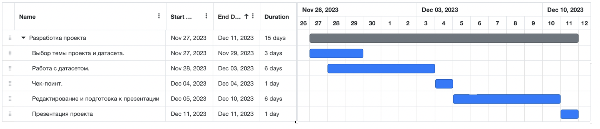

## Проект: Чат-бот для предсказания уровня солнечной радиации

### Направление проекта: Мониторинг экосистемы через IT-решения»

### Описание
Проект разрабатывается с целью создания пилотного проекта чат-бота, который использует модель машинного обучения для предсказания уровня солнечной радиации. Чат-бот будет обучен на основе метеорологических данных и погодных условий для предоставления прогнозов о солнечной радиации.

### Целевая аудитория: 
Люди, имеющие светлый цвет кожи и использующие солнцезащитные крема на постоянной основе. 

### Высокоуровневое содержание проекта заключается в выполнении следующих работ:
- Сбор данных. [Подготовленный датасет](SolarPrediction.csv)
- Разведовательный анализ [EDA](eda.ipynb)
- Выбрать наиболее эффективный алгоритм машинного обучения для реализации предсказания солнечной радиации.
- Обучение модели: использование машинного обучения для обучения модели прогнозирования уровня солнечной радиации [Модель](catboost.ipynb).
- Создание чат-бота: разработка и внедрение чат-бота для взаимодействия с пользователями и предоставления прогнозов **t.me/Solar_rad_bot**.

### Расписание контрольных событий проекта: 
Дата начала проекта: 27.11.2023 г. 
Дата окончание проекта: 11.12.2023 г.

### Календарный план-график реализации проекта:

**Название задачи**	Ресурсы (фамилии ответственного)
- Выбор темы проекта и датасета. ***Команда проекта***
- Работа с датасетом. ***Команда проекта***
- Чек-поинт. ***Рачитский Олег***
- Редактирование и подготовка к презентации. ***Гаар Надежда***
- Ведение проекта в GIT. ***Галиев Руслан***
- Презентация проекта. ***Рачитский Олег***

### Продуктовый результат: 
Чат-бот для предсказания выбора определенного значения фильтра в солнцезащитных кремах или необходимости его нанесения. 

### Технологии
- Python для обработки данных, обучения модели и разработки чат-бота.
- Библиотеки машинного обучения, такие как scikit-learn.
- Фреймворки для разработки чат-ботов.

### Развертывание
Проект будет развернут в телеграм чат боте. Модель развернута на локальной машине

### Команда
- Олег Рачитский - Руководитель проекта, 
- Гаар Надежда - Менеджер проекта, 
- Дрондина Дарья - Аналитик проекта , 
- Галиев Руслан - Аналитик проекта 